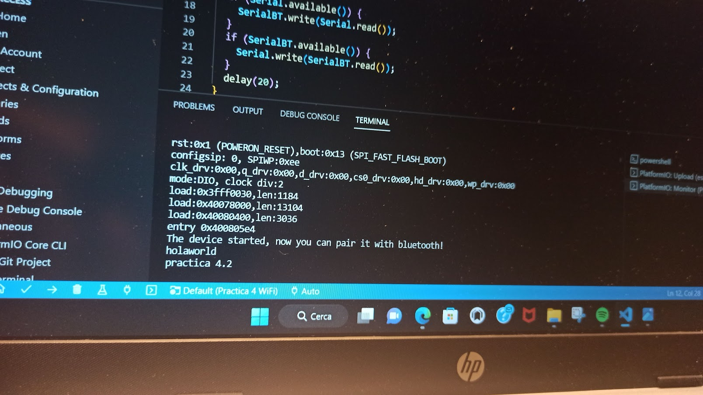
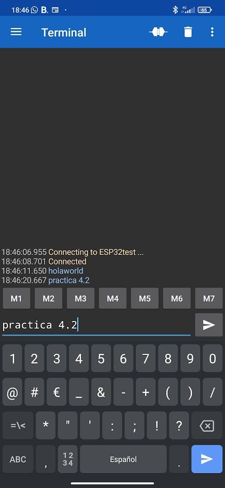

# Practica 4B: Bluetooth

En esta practica conoceremos como funciona el modulo bluetooth integrado en la ESP32 
## Codigo

```cpp
#include <Arduino.h>
#include <BluetoothSerial.h>

#if !defined(CONFIG_BT_ENABLED) || !defined(CONFIG_BLUEDROID_ENABLED)
#error Bluetooth is not enabled! Please run `make menuconfig` to and enable it
#endif

BluetoothSerial SerialBT;

void setup() {
  Serial.begin(115200);
  SerialBT.begin("ESP32test"); //Bluetooth device name
  Serial.println("The device started, now you can pair it with bluetooth!");
}

void loop() {
  if (Serial.available()) {
    SerialBT.write(Serial.read());
  }
  if (SerialBT.available()) {
    Serial.write(SerialBT.read());
  }
  delay(20);
}
```

## Explicación del Codigo

Para poder utilizar el modulo se requiere utilizar la siguiente libreria 

```cpp
#include <BluetoothSerial.h>
```

**Declarciones**

En este apartado el unico objeto que necesitamos declarar es el relacionado con la libreria 

```cpp
BluetoothSerial SerialBT;
```

**Set Up:**

 Iniciamos el Serial, el objeto que tendra con el nombre que se nos mostrara en los demas dispositivos 
 y enviaremos un mensaje por el serial cuando este este disponible para emparejar.
 
 ```cpp
 void setup() {
  Serial.begin(115200);
  SerialBT.begin("ESP32test"); //Bluetooth device name
  Serial.println("The device started, now you can pair it with bluetooth!");
}
```

**Loop:**

```cpp
void loop() {
  if (Serial.available()) {
    SerialBT.write(Serial.read());
  }
  if (SerialBT.available()) {
    Serial.write(SerialBT.read());
  }
  delay(20);
}
```


En el loop estaremos monitoreando el SerialBT para ver si recibimos informacion, en caso de recibir la mostraria por el Serial Monitor. 
En este caso para comprobar que funciona utilizaremos un app disponible para ANDROID llamada Serial Bluetooth Terminal para poder enviar mensajes de texto a traves de BT.





